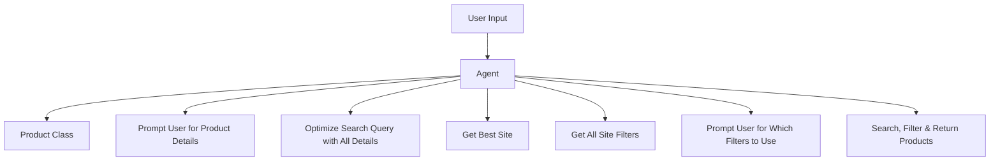

# Shopping Assistant 
Shopping Assistant built using Pydantic AI & Google Gemini LLM. 

## Demo Video

https://github.com/user-attachments/assets/9c60d0e7-a388-4da1-8e8d-58cb99d0af10

Helps : 
- Create the optimal search query 
- Retrieve the available filters for the product on the website 
- Filter out products based on User's preferences 
- Recommend the most suitable product as well as the top 10 candidates

## Table of Contents
- Introduction
- Demo Video
- Setup
- Workflow
- Results

## Introduction:
It is an agentic system built using Pydantic AI & Pydantic for data validation . All data is consistently validated. Google Gemini 2.5 Flash lite is used as the base LLM & flipkart is chosen as the shopping site currently. The agent has access to various tools :  
            - get_pro_class: Extract the product category & type from the user's query.
            - prompt_user0: Prompt the user for further details about the product.
            - rephrase_query : Generate a very concise product search query - combining original query & user provided details
            - get_best_site: Find the best website to search for the product.
            - get_site_filters: Retrieve all the available filters on the best site for the product.
            - prompt_user1: Prompt the user for further details about the product using the available filters
            - get_candidates : Return the best candidates found for the product 
& chooses them depending on the workflow , user's demands & its own logic.

Ideal Workflow: 

## Setup
To run the project locally: 

1.Install Python dependencies:
`pip install -r requirements.txt`

2.Clone the repository:
`git clone https://github.com/eshan1347/shop_agent`

3.Run:
`python pydantic_ai_agents.py`

## Results

This agentic system can be further improved by increasing the number of tools available - so that even more freedom is afforded to the agent. Web scraping data from websites add too much latency to the system - will further explore if any API's are available . Various other sites will be added so that products from various sites can be retrieved & a more holistic recommendation can be returned. 
